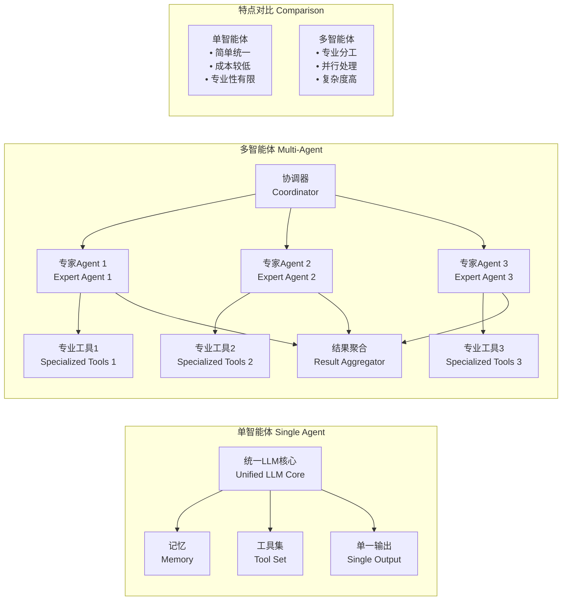
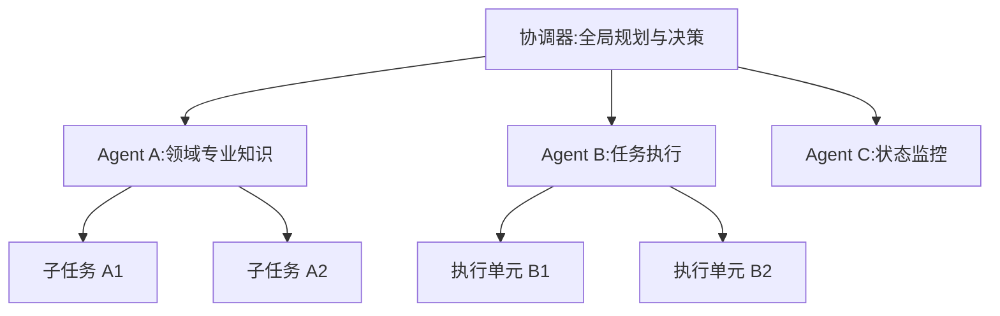
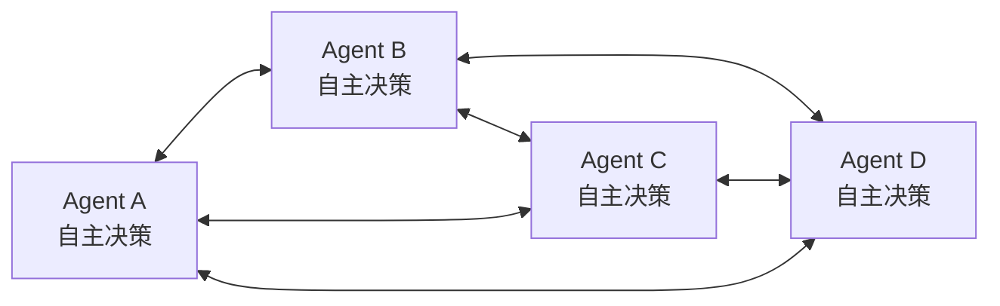
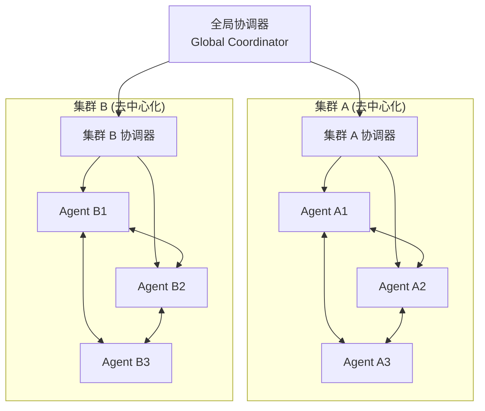
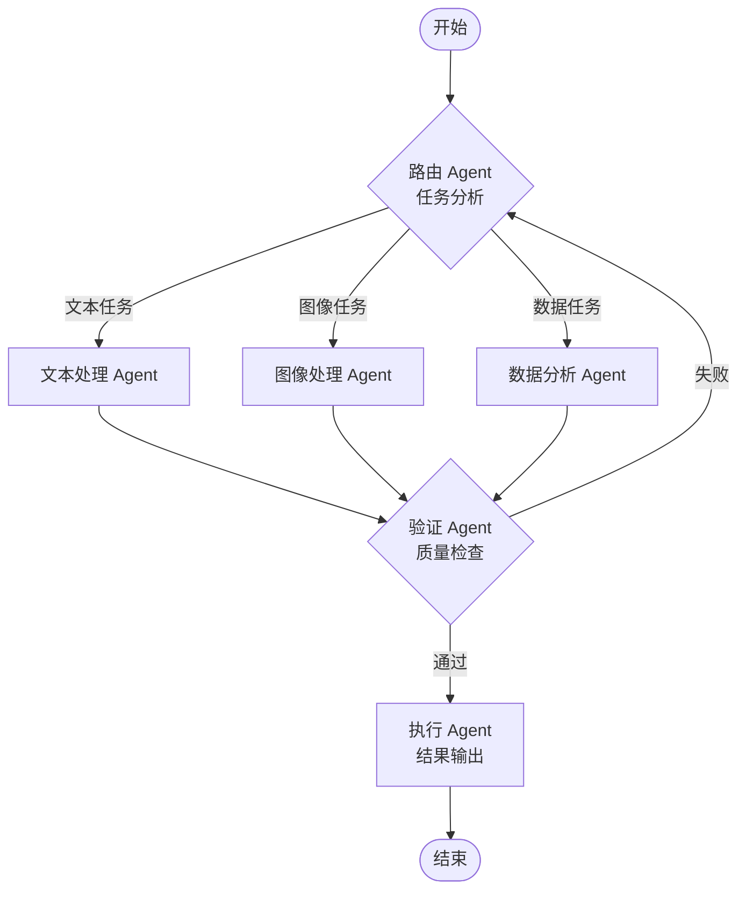

# AI Agent：从智能机器人到基于LLM Agent

## 什么是AI Agent

AI Agent是能够和环境进行交互、收集信息，并利用这些信息进行决策、采取行动以实现特定目标的智能系统。

### 类型

- 简单反应agent：对输入做响应
- 基于模式的agent：具备一定的记忆能力，可以根据状态来调整相应
- 目标型agent：具备规划能力
- 基于效用的agent：可以评估不同的方案，给出最优解
- 学习型agent：具体学习和提高能力

### AI Agent的历史

Agent的发展主要可以分为三个阶段：早期智能机器人 》 智能问答机器人 》 基于LLM的AI Agent

### 阶段一：早期智能机器人，基于规则和专家系统，功能相对简单。比如：
- **ELIZA（1966）**：早期的自然语言对话程序，模拟心理咨询师，通过简单的规则进行对话。
- **Expert Systems（如DENDRAL, MYCIN）**：基于规则的专家系统，应用于化学分析和医学诊断等领域。
这些早期机器人主要依赖于人工编写的规则和知识库，智能水平有限，为后续AI Agent的发展奠定了基础。

### 阶段二：基于机器学习和大数据的智能问答与助手系统，代表性产品包括：
- **Siri（2011）、小艺、小度、小爱等**：智能语音助手，集成在手机、音箱等设备中，具备语音交互、智能家居控制等功能。

这一阶段的智能机器人主要依赖于机器学习（如语音识别、自然语言理解）和大数据，能够理解用户的自然语言指令，并与互联网服务集成，实现更丰富的交互和自动化能力。虽然智能水平较早期有显著提升，但仍以“工具型助手”为主，缺乏自主规划和复杂推理能力。

### 阶段三：基于LLM的AI Agent

相比于阶段二，LLM（大语言模型）为智能机器人赋予了“灵魂”，带来了以下核心变革：

- **通用性与泛化能力**：LLM具备强大的知识迁移和泛化能力，不再局限于特定领域或任务，能够应对**开放域**的复杂对话和推理。
- **自主规划与推理**：LLM能够理解复杂指令，进行多步推理和自主任务拆解，具备一定的“思考”与“规划”能力。
- **上下文理解与记忆**：通过长上下文建模，LLM可以记住对话历史，实现更自然、连贯的人机交互。
- **知识整合与动态学习**：LLM在参数中蕴含了海量世界知识，并能通过检索、工具调用等方式动态补充新知识。
- **多模态能力**：新一代LLM支持文本、图像、语音等多模态输入输出，拓展了机器人的感知和表达能力。
- **Agent化架构**：LLM不仅作为“对话引擎”，更作为智能体的“决策大脑”，能够调用外部工具、API、插件，完成复杂任务编排。

基于LLM，可以构建很多类型的智能系统，可以分为三类：
1. 简单对话机器人：ChatGPT, DeepSeek, 通义千问等，只能完成问答，不能感知环境和执行动作；
2. Copilot：比较成熟的是各种辅助编码工具比如Github Copilot, CodeMate, Cursor，需要人工深入介入；
3. Agent：全智能系统，机器人从“工具型助手”进化为具备一定自主性、推理能力和复杂任务执行能力的“智能体”，成为AI发展的新范式。

## AI Agent架构

- **自主性**：可以无需人工干预，自主的执行各种命令（也可以人工介入保持控制）；
- **记忆**： 借助LLM的长上下文或者外部的记忆系统，保留和存储个人信息实现个性化，同时可以处理信息，制定决策；
- **感知/交互**：可以使用工具，感知和处理来自环境的信息，比如访问互联网、知识库，执行代码或者调用API；
- **协作**：Agent可以和其他Agent或人类协作完成任务。

### 常见架构

- 单智能体：单一LLM作为决策核心，独立完成任务规划和执行，具备完整的感知，推理，记忆和执行能力；实现简单但能力有限，扩展性差
- 多智能体：多个Agent协同，并行处理，模块化设计；处理交叉领域的任务
- 人机混合智能体：人与机器深度协作，在关键决策点引入人工干预；适用于高风险决策场景（医疗，金融），创意性工作

### 单智能体/多智能体架构比较

### 分层架构：按层级组织，形成树状或金字塔结构

### 去中心化架构

### 混合架构

### 工作流架构

## 如何构建基于LLM的AI Agent

AI Agent是一个复杂的系统，从头构建太难，基本都需要基于已有的框架来实现。

### CrewAI

特点：
- 多智能体
- 灵活自定义

CrewAI是一个基于角色分工的多智能体协作框架，通过定义不同角色的Agent（如研究员、分析师、写手等）来协同完成复杂任务，类似于组建一个专业团队来处理项目。

### AutoGen

特点：
- 多智能体

AutoGen是微软开发的对话式多智能体框架，通过让多个AI智能体进行自动化对话来协作解决复杂问题，支持人工参与和代码执行。

### Langchain

特点：
- 多模型
- 工作流

强调连接不同语言模型和外部API构建复杂工作流，适合打造LLM驱动的应用和数据驱动系统，搭建多智能体决策流程。

### Langgraph

特点：
- 多智能体
- 基于图构建处理网络

支持多agent之间的图结构工作流，解决复杂分支和循环决策问题，适用于需要结构严谨的多agent系统。

### [Dify](https://dify.ai/)

特点：
- 工作流
- 开源
- 低码

开源的低代码/无代码生成式AI应用开发框架，专门为快速构建和部署基于大型语言模型（LLM）的应用程序而设计。支持可视化的工作流编排，兼容各类模型，插件丰富。

### [Coze](https://www.coze.cn/studio)

> 和Dify是直接竞争关系。

特点：
- 低码
- 完整解决方案，可以和已有的系统简便连接

### 几种常见的场景级Agent实现

- Agentic RAG：具备自主规划和多轮交互能力的增强RAG系统，能够分解问题，多步检索
- Deep(re)search: 执行复杂的在线研究任务，可以浏览大量网站，分析信息，综合结果形成详细的研究报告；Perplexity.ai
- 目标型Agent
- 代码助手：Cursor，Github Copilot
- 创意设计：Midjourney, Figma AI
- 业务流程自动化
- 智能客服

## Reference

- [What is an AI Agent?](https://bytebytego.com/guides/what-is-an-ai-agent/)
- [AI agents开发框架](https://github.com/e2b-dev/awesome-ai-agents)
- [AI Agent 框架大盘点](https://zhuanlan.zhihu.com/p/1943334709066175416)
